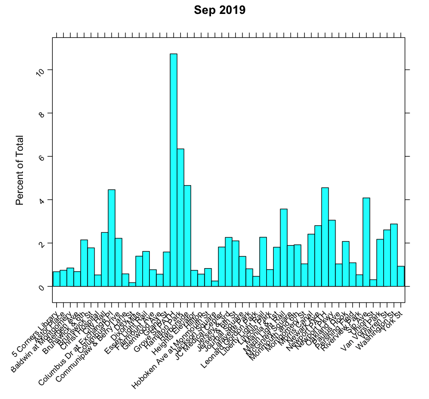
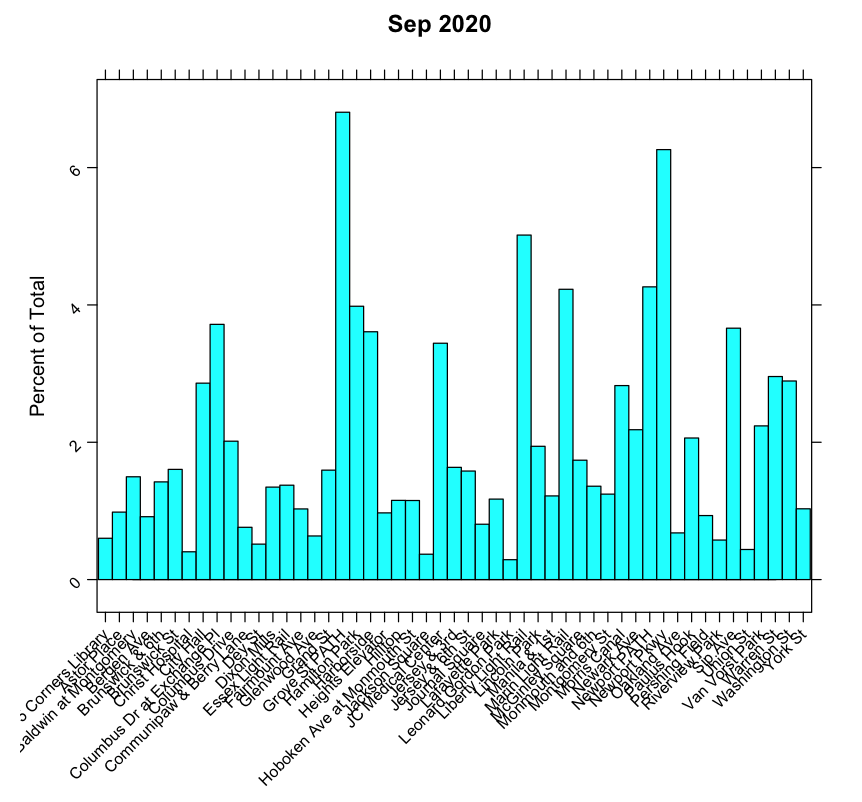
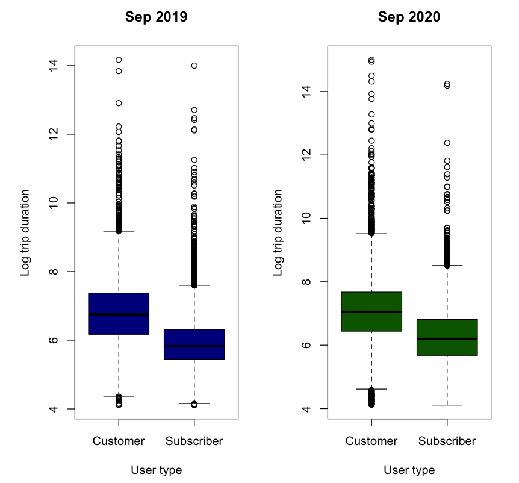
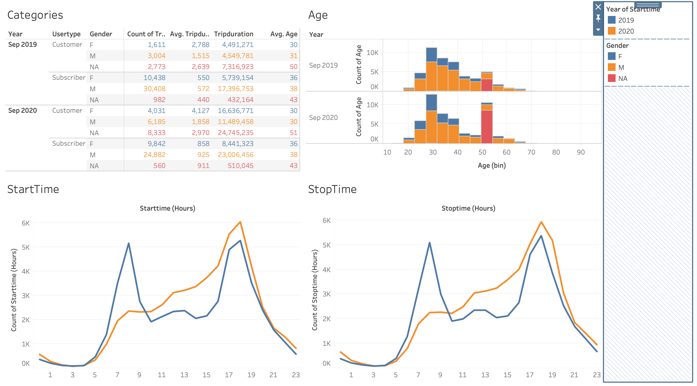
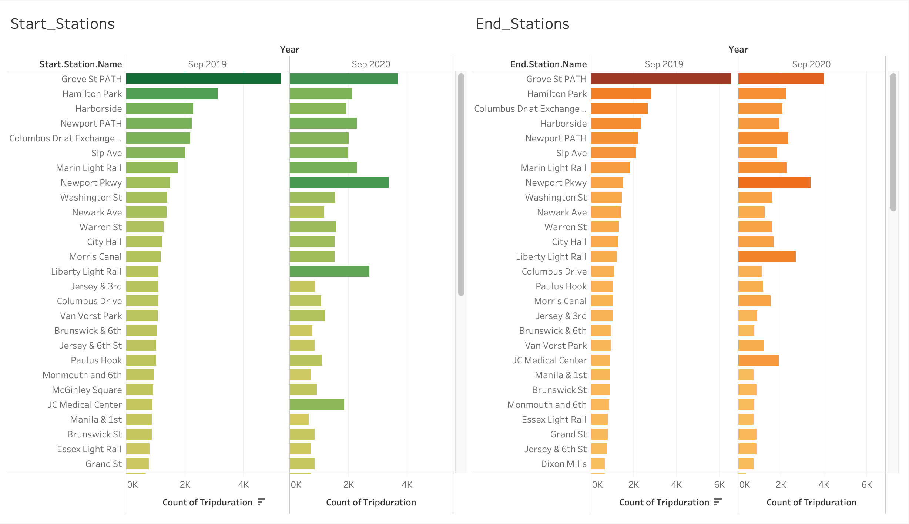
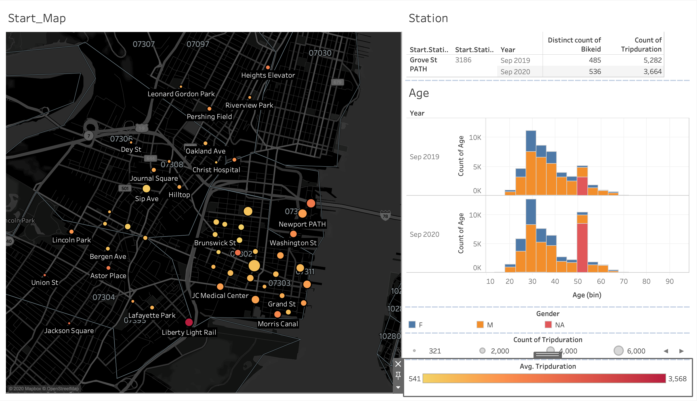

# City Bike Analytics

* Aggregate the data found in the Citi Bike Trip History Logs and find unexpected phenomena
* Data Source: https://www.citibikenyc.com/system-data

## Data Exploration in R

## Analysis in R

## Tableau Visualization

* Published Story Link: https://public.tableau.com/profile/oleg2035#!/vizhome/City_Bike_Analytics_16037248207960/Story
